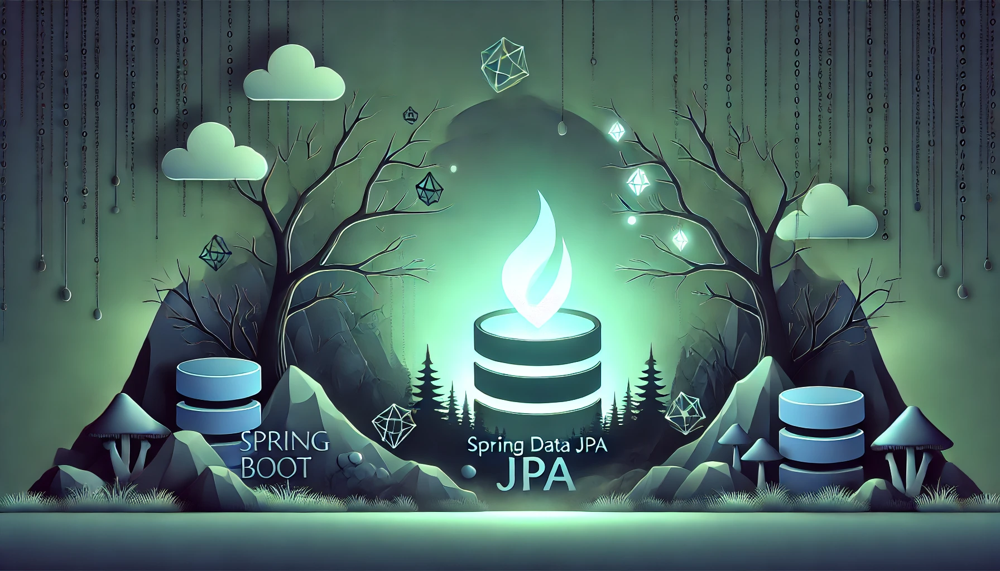

# Bienvenidos Geeks y Freaks

Este proyecto fue pensado con la idea de poder ayudar a aquellos que estan recien empezando en la implementacion de JPA en sus proyectos. Solo deben descargar el zip, descomprimir la carpeta, abrirla con IDE de prefenrencia.
<br>Luego de abrirlo solo deben ejecutarlo para probar como funciona usando postman. Aqui debajo les dejare los endpoint que deben usar para obtener resultados de la API y ejemplos de como se verian al consultar desde postman.

- saveMonster = `POST`: http://localhost:8080/monster

````JSON
{
    "name": "Vampiro",
    "origin": "Rumania",
    "type": "Humano Maldecido",
    "weakness": "Luz solar.",
    "id": 33
}
````
- getAllMonsters = `GET`: http://localhost:8080/monsters
````JSON
[
    {
        "name": "La llorona",
        "origin": "Multiple",
        "type": "Espectro",
        "weakness": "Los espiritus de sus hijos muertos, hierro y sal.",
        "id": 1
    },
    {
        "name": "El Wendigo",
        "origin": "EE.UU",
        "type": "Humano Maldecido",
        "weakness": "Fuego",
        "id": 2
    },
    {
        "name": "Oh nanoko no ana",
        "origin": "Corea",
        "type": "Espectro",
        "weakness": "Hierro y sal.",
        "id": 3
    },
    {
        "name": "Hombre Lobo",
        "origin": "Multiple",
        "type": "Humano Maldecido",
        "weakness": "Plata.",
        "id": 4
    },
    {
        "name": "Vampiro",
        "origin": "Rumania",
        "type": "Humano Maldecido",
        "weakness": "Luz solar.",
        "id": 33
    }
]
````
- getAllMonstersByType = `GET`: http://localhost:8080/api/monsters/type/Humano Maldecido
````JSON
[
    {
        "name": "El Wendigo",
        "origin": "EE.UU",
        "type": "Humano Maldecido",
        "weakness": "Fuego",
        "id": 2
    },
    {
        "name": "Hombre Lobo",
        "origin": "Multiple",
        "type": "Humano Maldecido",
        "weakness": "Plata.",
        "id": 4
    },
    {
        "name": "Vampiro",
        "origin": "Rumania",
        "type": "Humano Maldecido",
        "weakness": "Luz solar.",
        "id": 33
    }
]
````
- getAllMonstersByOrigin = `GET`: http://localhost:8080/api/monsters/origin/Multiple
````JSON
[
    {
        "name": "La llorona",
        "origin": "Multiple",
        "type": "Espectro",
        "weakness": "Los espiritus de sus hijos muertos, hierro y sal.",
        "id": 1
    },
    {
        "name": "Hombre Lobo",
        "origin": "Multiple",
        "type": "Humano Maldecido",
        "weakness": "Plata.",
        "id": 4
    }
]
````